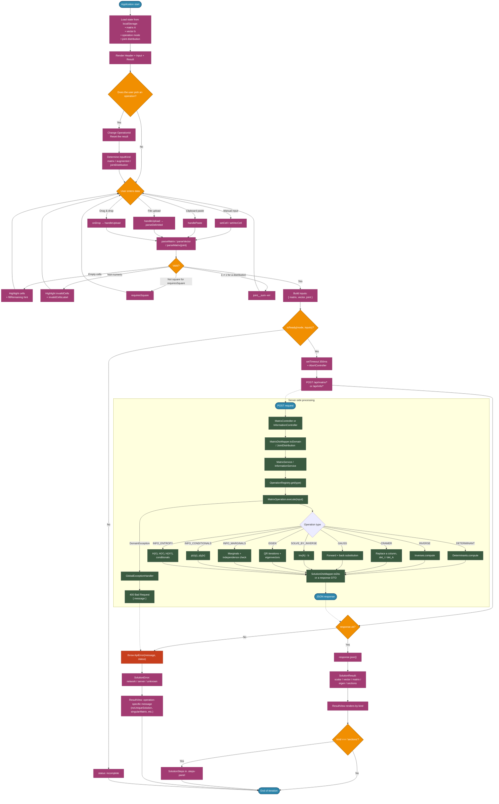

# Mat-Calc Behavior Flow

The application does not involve a long-running dialogue or an AI agent — it is an interactive calculator. The main scenario is: the user picks an operation, enters data, the application validates the input, sends a request to the backend, and renders the result.

## General logic

1. The user selects an operation in the header.
2. The application determines what kind of input is required:
   - `matrix` — only the matrix `A`;
   - `augmented` — the augmented matrix `[A | b]`;
   - `jointDistribution` — a joint distribution table.
3. The user fills in the cells (manually, by pasting, or by uploading a CSV/TSV file).
4. The frontend parses the values and validates them:
   - empty cells;
   - non-numeric values;
   - for a distribution — non-negativity and a sum of `1`.
5. If the input is valid, a debounced request to the API is triggered.
6. The backend re-validates the data, picks an operation from the registry, and executes it.
7. The response is rendered as:
   - a scalar (determinant);
   - a vector (solution of a linear system);
   - a matrix (inverse);
   - eigen pairs;
   - sections with a step-by-step solution.

## Frontend constraints

- The maximum size of a matrix / vector / distribution is `10 × 10` (the `MAX_SIZE` constant).
- The matrix edit history is limited to 50 snapshots (with coalescing at 600 ms).
- The request debounce is 350 ms (`DEBOUNCE_MS` in `useSolution`).
- The result is reset whenever the operation changes.

## Backend constraints

- The matrix must not be empty and must be rectangular.
- Squareness is required for: `determinant`, `inverse`, `eigen`, `cramer`, `solveByInverse`, `gauss`.
- The length of the `constants` vector must match the order of the matrix.
- The probability distribution must be non-negative and must sum to `1` with tolerance `1e-6`.
- Only real eigenvalues are computed; otherwise `400 Bad Request`.

## Key frontend states

| State | Description |
| :--- | :--- |
| `incomplete` | The input is not yet complete or is invalid; no request is sent. |
| `loading` | A request to the backend is in flight; a spinner is shown and the previous result is dimmed. |
| `success` | A response has been received and the result is displayed. |
| `error` | A network or server error occurred; a human-readable message is displayed. |

## Client-side error classification

| Error type | Source | Rendering |
| :--- | :--- | :--- |
| `network` | `fetch` failed without a response | `errorNetwork` |
| `server` | `4xx / 5xx` | An operation-specific message or `errorServer` |
| `unknown` | Any other exception | `errorCompute` |

## Diagram

## How to read it

- **The left side** is the client: operation selection, input, validation, debouncing, and rendering.
- **The subgraph at the bottom** is the backend: DTO mapping, the operation registry, execution, and response serialization.
- **Red nodes** mark the points where the client turns an API error into a human-readable message.
- Dashed arrows represent client–server synchronization over HTTP.

## Notes for further development

- Adding a new operation requires changes on both the frontend and the backend: see the "How to add a new operation" section in `files_tree.en.md`.
- The backend operation registry (`OperationRegistry`) registers every bean annotated with `@Component` that implements `MatrixOperation<I, O>`. A new bean is registered automatically.
- On the frontend, a new operation means a new entry in `OPERATIONS` (`operations.tsx`), a new API function, and a new branch in `useSolution`.
- On the backend, the joint distribution is the `JointDistribution` domain model, which immediately computes the marginals and can return conditional probabilities. Reusing it in new information theory operations is preferable.