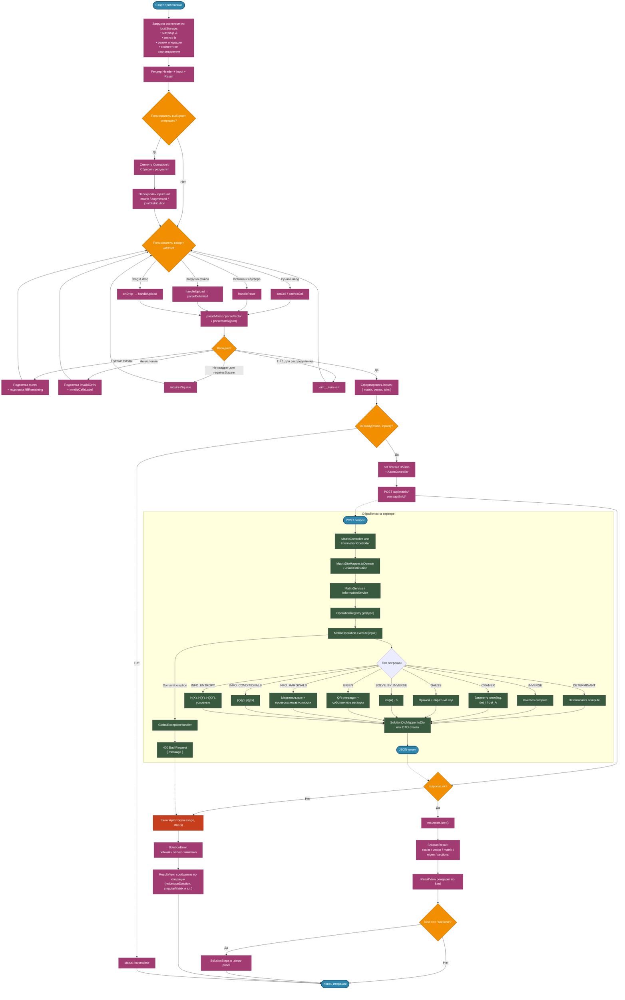

# Схема работы Mat-Calc

Приложение не содержит длительного диалога или AI-агента — это интерактивный калькулятор. Основной сценарий: пользователь выбирает операцию, вводит данные, приложение валидирует ввод, отправляет запрос на бэкенд и отображает результат.

## Общая логика

1. Пользователь выбирает операцию в шапке.
2. Приложение определяет, какой ввод нужен:
   - `matrix` — только матрица `A`;
   - `augmented` — расширенная матрица `[A | b]`;
   - `jointDistribution` — таблица совместного распределения.
3. Пользователь заполняет ячейки (вручную, вставкой или загрузкой CSV/TSV).
4. Фронтенд парсит значения и валидирует:
   - пустые ячейки;
   - нечисловые значения;
   - для распределения — неотрицательность и сумма `= 1`.
5. Если ввод валиден — запускается дебаунс-запрос к API.
6. Бэкенд валидирует данные повторно, выбирает операцию из реестра и выполняет её.
7. Ответ отображается:
   - скаляр (определитель);
   - вектор (решение СЛАУ);
   - матрица (обратная);
   - собственные пары;
   - секции с пошаговым решением.

## Ограничения на фронтенде

- Максимальный размер матрицы/вектора/распределения — `10 × 10` (константа `MAX_SIZE`).
- История изменений матрицы ограничена 50 снапшотами (с коалесцированием по 600 мс).
- Дебаунс запросов — 350 мс (`DEBOUNCE_MS` в `useSolution`).
- При смене операции результат сбрасывается.

## Ограничения на бэкенде

- Матрица не должна быть пустой и обязана быть прямоугольной.
- Квадратность обязательна для: `determinant`, `inverse`, `eigen`, `cramer`, `solveByInverse`, `gauss`.
- Длина вектора `constants` должна совпадать с порядком матрицы.
- Распределение вероятностей — неотрицательное и суммируется в `1` с точностью `1e-6`.
- Собственные значения ищутся только действительные — иначе `400 Bad Request`.

## Ключевые состояния фронтенда

| Состояние | Описание |
| :--- | :--- |
| `incomplete` | Ввод ещё не заполнен или невалиден, запрос не отправляется. |
| `loading` | Идёт запрос к бэкенду; отображается индикатор, предыдущий результат затенён. |
| `success` | Получен ответ, результат отображается. |
| `error` | Ошибка сети или сервера, показывается человекочитаемое сообщение. |

## Классификация ошибок на клиенте

| Тип ошибки | Источник | Отображение |
| :--- | :--- | :--- |
| `network` | `fetch` упал без ответа | `errorNetwork` |
| `server` | `4xx/5xx` | Специфичное сообщение по операции или `errorServer` |
| `unknown` | Иное исключение | `errorCompute` |

## Диаграмма

## Как это читать

- **Левая часть** — клиент: выбор операции, ввод, валидация, дебаунс и отображение.
- **Нижний подграф** — бэкенд: маппинг DTO, реестр операций, выполнение и сериализация ответа.
- **Красным** — точки, где клиент превращает ошибку API в человекочитаемое сообщение.
- Пунктирные стрелки — синхронизация между клиентом и сервером через HTTP.

## Особенности, важные при доработке

- Добавление операции требует правок и на фронте, и на бэке: см. раздел «Как добавить новую операцию» в `files_tree.ru.md`.
- Реестр операций на бэке (`OperationRegistry`) регистрирует всё, что помечено `@Component` и реализует `MatrixOperation<I, O>`. Достаточно создать новый бин — регистрация автоматическая.
- На фронте новая операция — это новая запись в `OPERATIONS` (`operations.tsx`), новая API-функция и новая ветка в `useSolution`.
- Совместное распределение на бэке — это доменная модель `JointDistribution`, которая сразу считает маргиналы и умеет отдавать условные вероятности. Использовать её в новых операциях по теории информации — предпочтительно.